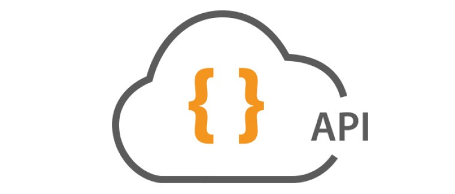

# { Games : Rest API } 🎮




## About API 📚
This is an Rest API witch the users can see a Games list, registered in database. However, when the users register themselves, they have free access to some routes, in witch, they can **register a new game**, **delete a existing game** and **update or change information about some game**. This Rest API was made to learn more about the *http* methods and see the *http's* status code.

## Building ⚙
You'll need [Node.js](https://nodejs.org) and i recommend that you have installed the [Yarn](https://classic.yarnpkg.com/en/docs/install/#windows-stable) on your computer. With your setup completed, you will need to instal [MySQL](https://www.mysql.com/), and create an empty database.

Before register the games, you need to register a user, and log in with this user email. Logging in, get the generated *Token Code*, and user this token to access, the others games Routes, passing the token as a value in authentication ``Bearer Token``.

This is API is running at port ``3333`` ```http://localhost:3333```;
<br>

#### Clone
```bash
git clone https://github.com/gabriellopes00/Happy.git
```

#### Running with yarn 🐿
```ssh
cd Games_RestAPi
yarn install
yarn dev
```

#### Running with npm 🔧
```ssh
cd Games_RestAPi
npm install
npm run dev
```

## Contact 📱
[](https://github.com/gabriellopes00)
[](https://www.linkedin.com/in/gabriel-lopes-6625631b0/)
[](https://twitter.com/_gabrielllopes_)
[](mailto:gabrielluislopes00@gmail.com)
  <a href="https://www.facebook.com/profile.php?id=100034920821684">
      
  </a> 
  <a href="https://www.instagram.com/_.gabriellopes/?hl=pt-br">
    
  </a>
